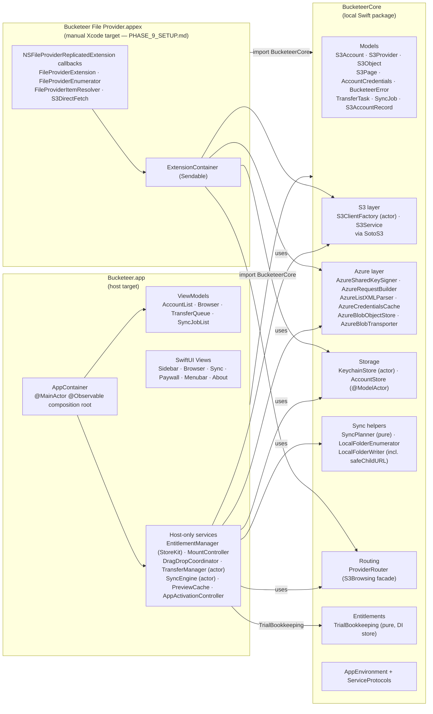
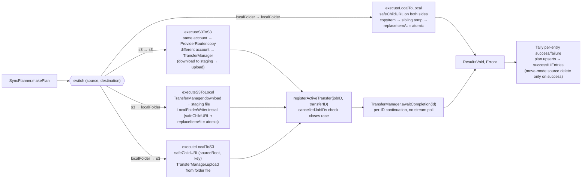
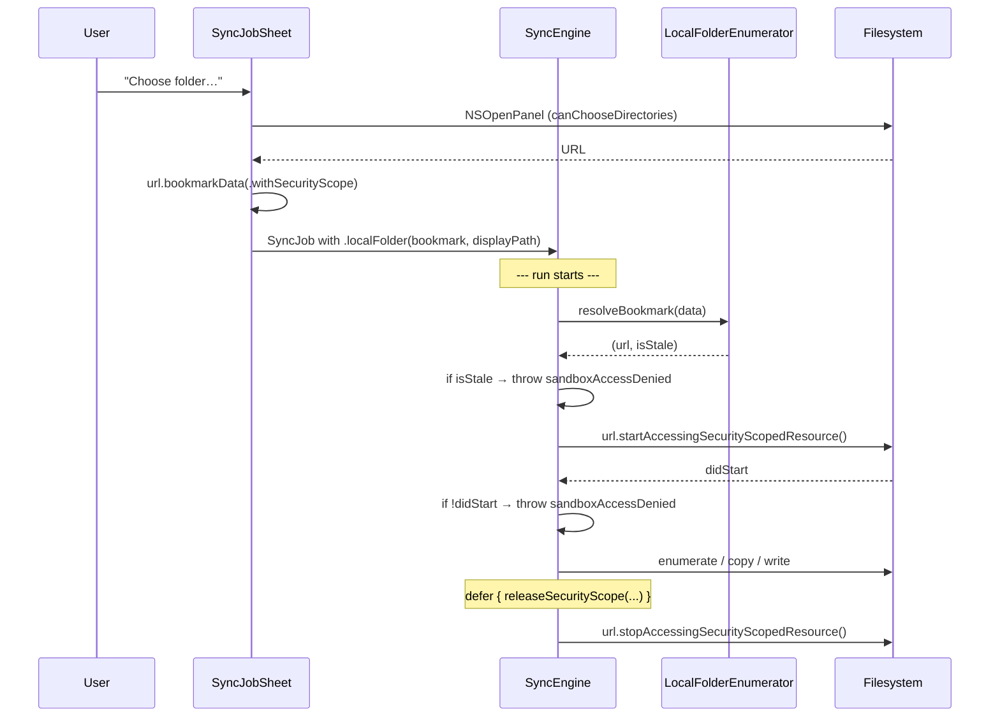
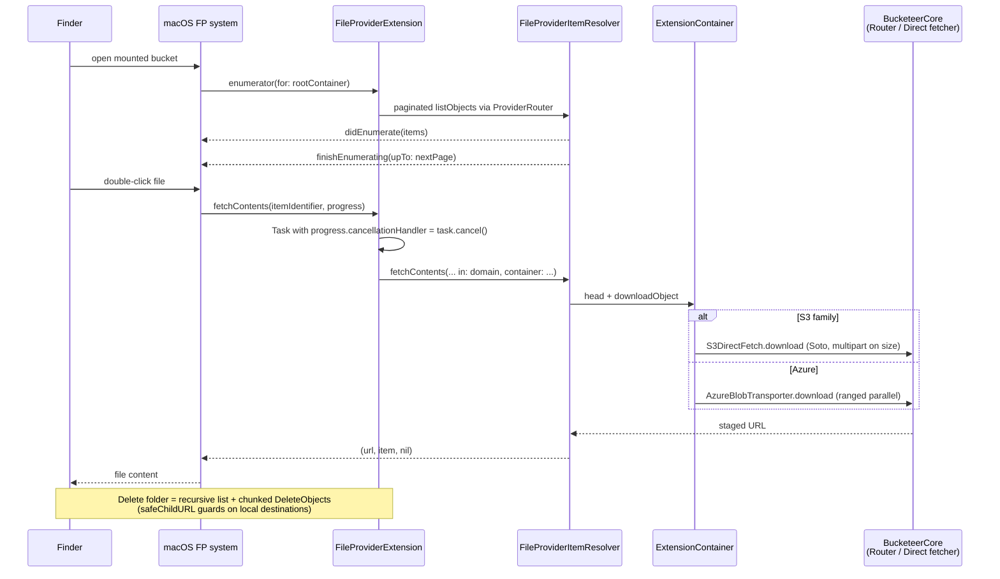
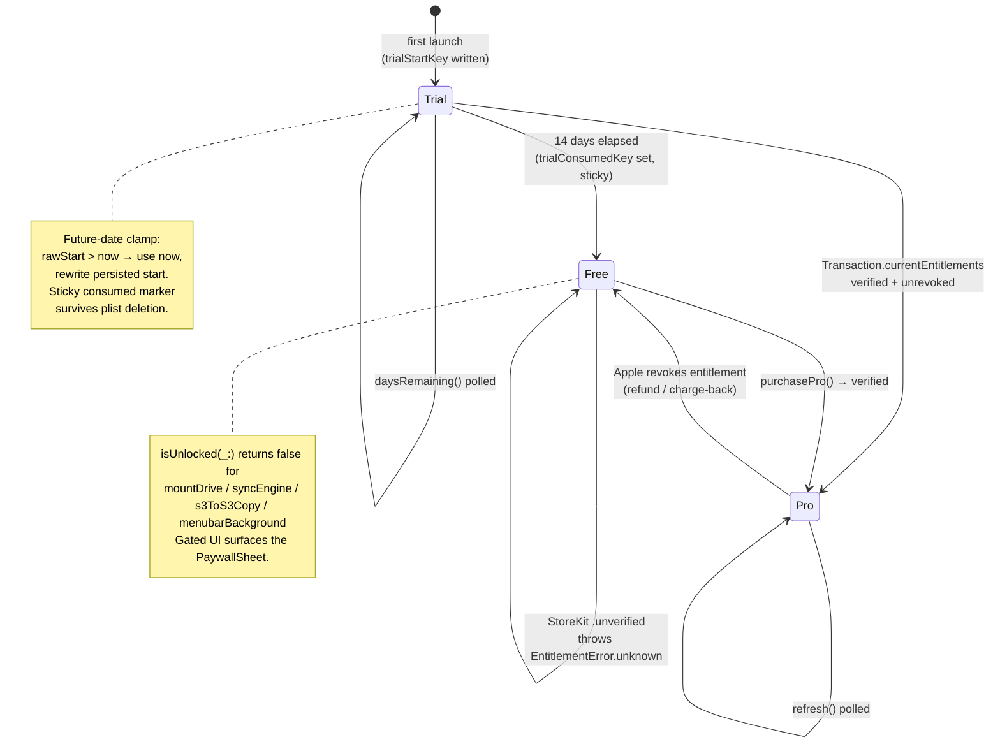
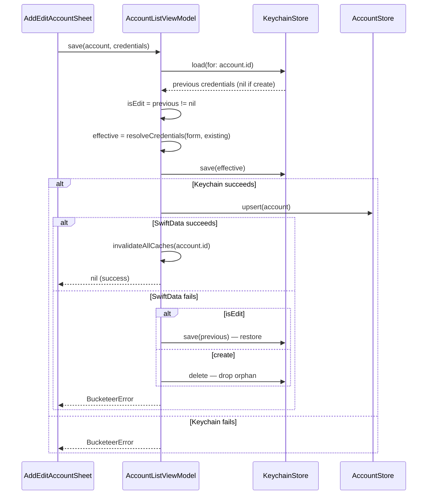
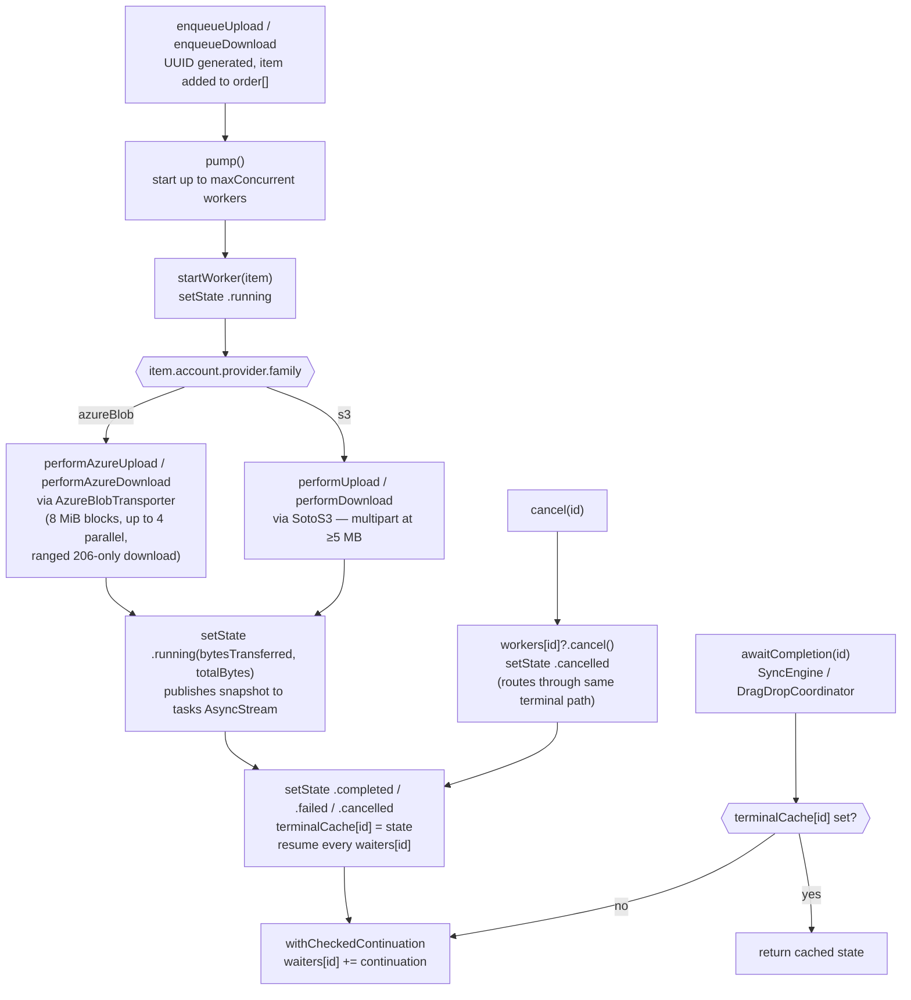
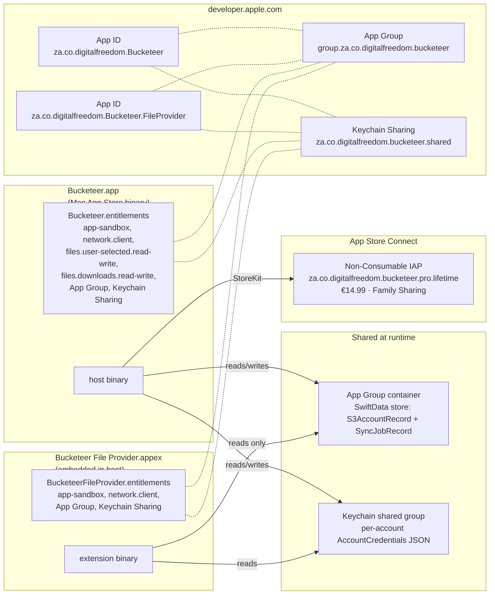

# Bucketeer — Architecture

This document is the canonical architectural reference: how the host
app, the BucketeerCore Swift package, and the File Provider extension
fit together; how the four sync-routing paths land; how the entitlement
state machine moves; and where the provisioning identifiers live. The
per-release history is in [`CHANGELOG.md`](../CHANGELOG.md).

---

## 1. Module composition

Bucketeer ships as one Mac App Store binary made of three buildable
units. `BucketeerCore` is the seam everything cross-cuts on; the host
and the (yet-to-be-target-wired) File Provider extension both link it.



**Why this layout:** the design spec §3 wanted shared `Models` + `Services`
between host and extension. Phase 9.5 extracted them into
`BucketeerCore` so neither side duplicates code and a test target can
hammer the storage / network / signing surface without a UI.

---

## 2. Sync routing — Phase 9.8 four-way matrix

Each side of a `SyncJob` is one of two cases:

```swift
public enum SyncEndpoint: Codable, Hashable, Sendable {
    case s3(accountID: UUID, bucket: String, prefix: String)
    case localFolder(bookmark: Data, displayPath: String)
}
```

`SyncEngine.execute(upsert:job:context:)` switches over
`(job.source, job.destination)` and routes to one of four execution
paths. Local-folder sides resolve their security-scoped bookmark
once per run (start before the loop, guaranteed `stop` via `defer`).



**Sandbox lifecycle for local-folder endpoints:**



---

## 3. File Provider replicated-extension contract

The extension lives at `Bucketeer File Provider/`. One
`NSFileProviderDomain` per mounted bucket, identifier
`"<accountID>::<bucket>"`. Every callback is bridged through
`Progress.cancellationHandler` so Finder cancellations actually stop
the network traffic.



**Capability rules per item type** (Codex medium #10 fix):

| Item | Capabilities |
|---|---|
| `.rootContainer` | `[.allowsContentEnumerating, .allowsAddingSubItems]` — bucket itself can't be renamed/deleted |
| folder (`key.hasSuffix("/")`) | `[.allowsContentEnumerating, .allowsAddingSubItems, .allowsDeleting, .allowsRenaming]` |
| file | `[.allowsReading, .allowsWriting, .allowsDeleting, .allowsRenaming]` |

---

## 4. Entitlement state machine (Phase B)

`TrialBookkeeping` (Core, pure) drives the state; `EntitlementManager`
(host, `@MainActor @Observable`) wraps it with the StoreKit lifecycle.



---

## 5. Account add / edit transactional flow

Saves Keychain first, then SwiftData. Codex high #7 ensures rollback
distinguishes edit (restore previous credentials) from create
(delete the new orphan).



---

## 6. Multipart transfer flow (Soto / Azure)

`TransferManager` is the actor-backed queue with bounded
concurrency, the snapshot stream the UI consumes, and the per-ID
`awaitCompletion(id:)` API the sync engine + drag-drop coordinator
suspend on. Cancellation routes through `setState` so waiters get
resumed (Codex blocker #2 fix).



---

## 7. Provisioning and signing topology

What lives where (App Sandbox + entitlements + provisioning):



---

## 8. Test architecture

Tests live in `BucketeerCore/Tests/BucketeerCoreTests/`. `swift test`
runs them in ~25 ms; no Xcode test target is required.

| Suite | Tests | What it locks |
|---|---|---|
| `AzureSharedKeySigner` | 10 | StringToSign construction, canonical headers/resource, GET vs PUT Content-Length, signed Authorization shape |
| `AzureRequestBuilder` | 9 | URL composition, slash preservation, percent encoding, block-ID equal-length invariant, blockListXML body |
| `AzureListXMLParser` | 6 | container listing, blob listing with BlobPrefix + NextMarker, error envelope parse |
| `S3ClientFactory.endpoint` | 12 | per-provider URL templates (AWS, Civo, R2, B2, Wasabi, DO, Storj, Azure default + sovereign, Custom) |
| `S3Provider` | 11 | defaults, family routing, picker visibility flags, accountID requirements |
| `SyncPlanner` | 19 | plan computation, prefix relocation, name+size vs name+ETag, mirror deletes respect globs, 5 local-folder cases |
| `TrialBookkeeping` | 11 | trial start, expiry, sticky consumed marker, future-date clamp, custom length |
| `LocalFolderWriter.safeChildURL` | 6 | empty / absolute / `..` / `.` / legitimate paths |
| **Total** | **84** | |

Pure logic that lived in host classes was extracted to Core in three
waves (SyncPlanner, TrialBookkeeping, LocalFolderWriter) precisely
because Core tests are cheaper to wire than a host XCTest bundle.

---

## 9. Source-of-truth map

| Concern | File / dir |
|---|---|
| Composition root + SwiftData store URL migration | `Bucketeer/Services/AppContainer.swift` |
| App lifecycle (Window, MenuBarExtra, AppDelegate) | `Bucketeer/App/BucketeerApp.swift` |
| Provider endpoint matrix | `BucketeerCore/Sources/BucketeerCore/Models/S3Provider.swift` + `S3/S3ClientFactory.swift` |
| Azure signing | `BucketeerCore/Sources/BucketeerCore/Services/Azure/AzureSharedKeySigner.swift` |
| Per-family routing | `BucketeerCore/Sources/BucketeerCore/Services/ProviderRouter.swift` |
| Sync routing (4 paths) | `Bucketeer/Services/Sync/SyncEngine.swift` |
| Sync planning (pure) | `BucketeerCore/Sources/BucketeerCore/Services/Sync/SyncPlanner.swift` |
| Path-traversal guard | `BucketeerCore/Sources/BucketeerCore/Services/Sync/LocalFolderEnumerator.swift` (`LocalFolderWriter.safeChildURL`) |
| Trial logic | `BucketeerCore/Sources/BucketeerCore/Services/Entitlements/TrialBookkeeping.swift` |
| File Provider host coordinator | `Bucketeer/Services/MountController.swift` |
| File Provider extension | `Bucketeer File Provider/*` |
| Per-phase changelog | `CHANGELOG.md` |
| Manual setup checklist | `PHASE_9_SETUP.md` |
| App Store metadata draft | `docs/APP_STORE_METADATA.md` |
